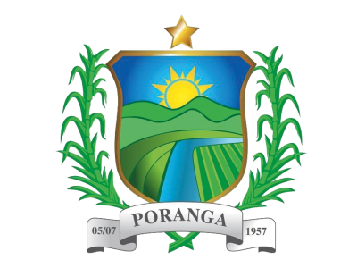

# 🌿 Visite Poranga

<p align="center">
  
</p>

<h1 align="center">
Visite Poranga
</h1>

<p align="center">
Portal Oficial de Turismo de Poranga - Ceará
</p>

<p align="center">

Uma plataforma moderna desenvolvida para divulgar os atrativos turísticos, culturais, históricos e naturais do município de Poranga, oferecendo uma experiência intuitiva, responsiva e acessível para moradores e visitantes.

</p>

---

## 📸 Preview

> Em breve

_(Após o deploy, adicione aqui uma captura da página inicial ou um GIF demonstrando a navegação.)_

---

# 🌎 Sobre o projeto

O **Visite Poranga** nasceu com o objetivo de valorizar um dos municípios mais bonitos da Serra das Matas, reunindo em um único portal informações sobre:

- 🏞️ Cachoeiras
- 🌄 Mirantes
- 🥾 Trilhas
- 🏛️ Patrimônio Histórico
- 🎭 Cultura Local
- 🍽️ Gastronomia
- 🛏️ Hospedagem
- 📅 Eventos
- 🗺️ Planejamento da viagem

O projeto foi pensado para oferecer uma experiência semelhante aos grandes portais oficiais de turismo brasileiros, priorizando velocidade, acessibilidade, design moderno e excelente experiência do usuário.

---

# ✨ Funcionalidades

## Página Inicial

- ✅ Hero com vídeo em background
- ✅ Header transparente inteligente
- ✅ Navegação responsiva
- ✅ Seção institucional
- ✅ Cards de experiências
- ✅ Guia do visitante
- ✅ Destaques turísticos
- ✅ Mapa integrado
- ✅ Call To Action
- ✅ Footer institucional

---

## Planejado

- Página História
- Página Cultura
- Página Atrativos
- Guia Local
- Planeje sua Visita
- Agenda Cultural
- Blog
- Eventos
- Pesquisa Inteligente
- Favoritos
- Painel Administrativo

---

# 🚀 Tecnologias

O projeto foi desenvolvido utilizando:

- Next.js 15
- React
- TypeScript
- Tailwind CSS
- Lucide React
- Google Maps
- Vercel

---

# 📁 Estrutura do projeto

```text
app/
│
├── layout.tsx
├── page.tsx
│
components/
│
├── site-header.tsx
├── site-footer.tsx
├── attraction-card.tsx
│
├── home-hero.tsx
├── home-intro.tsx
├── home-experiences.tsx
├── home-visitor-guide.tsx
├── home-highlights.tsx
├── home-map.tsx
├── home-cta.tsx
│
lib/
│
├── data.ts
├── utils.ts
│
public/
│
├── brasão.jpg
├── videos/
├── images/
│
styles/
```

---

# 🏗️ Arquitetura

O projeto utiliza uma arquitetura baseada em componentes reutilizáveis.

```text
Home
│
├── SiteHeader
├── HomeHero
├── HomeIntro
├── HomeExperiences
├── HomeVisitorGuide
├── HomeHighlights
├── HomeMap
├── HomeCTA
└── SiteFooter
```

Todos os componentes são independentes, facilitando manutenção, escalabilidade e reutilização.

---

# 🎨 Design System

O portal segue princípios modernos de UX/UI.

## Diretrizes

- Mobile First
- Design Responsivo
- Alto contraste
- Hierarquia visual
- Espaçamento consistente
- Componentização
- Microinterações
- Performance
- Acessibilidade

---

# 📱 Responsividade

O portal foi otimizado para:

- Desktop
- Notebook
- Tablet
- Smartphones

---

# ⚡ Performance

O projeto foi desenvolvido priorizando:

- Lazy Loading
- Componentização
- Imagens otimizadas
- Código limpo
- SEO
- Acessibilidade
- Performance no Lighthouse

---

# 🔍 SEO

Estrutura preparada para otimização em mecanismos de busca.

Inclui:

- Meta Tags
- Open Graph
- URLs amigáveis
- Heading Structure
- Semantic HTML
- Performance otimizada

---

# 🛠️ Como executar

## Clone o projeto

```bash
git clone https://github.com/SEU_USUARIO/visite-poranga.git
```

Entre na pasta

```bash
cd visite-poranga
```

Instale as dependências

```bash
npm install
```

ou

```bash
pnpm install
```

Execute o projeto

```bash
npm run dev
```

ou

```bash
pnpm dev
```

Abra no navegador

```
http://localhost:3000
```

---

# 📂 Rotas

| Página             | Rota                |
| ------------------ | ------------------- |
| Home               | /                   |
| Atrativos          | /pontos-turisticos  |
| História           | /historia           |
| Cultura            | /cultura            |
| Guia Local         | /guia-local         |
| Planeje sua visita | /planeje-sua-visita |
| Eventos            | /eventos            |
| Blog               | /blog               |

---

# 🗺️ Roadmap

## ✅ Concluído

- [x] Header
- [x] Hero
- [x] Home Intro
- [x] Experiências
- [x] Guia do Visitante
- [x] Destaques
- [x] Google Maps
- [x] CTA
- [x] Footer

---

## 🚧 Em desenvolvimento

- [ ] Página História
- [ ] Página Cultura
- [ ] Página Atrativos
- [ ] Guia Local
- [ ] Planejamento de Viagem
- [ ] Eventos
- [ ] Blog

---

## 🔮 Futuras implementações

- Sistema de favoritos
- Pesquisa de atrativos
- Agenda Cultural
- CMS Administrativo
- Painel de gerenciamento
- Internacionalização (Português / Inglês)
- Integração com APIs de clima
- Integração com Google Maps API
- Compartilhamento Social
- Modo escuro

---

# ♿ Acessibilidade

O projeto segue boas práticas de acessibilidade.

- HTML Semântico
- Navegação por teclado
- Textos alternativos
- Contraste adequado
- Componentes acessíveis
- Hierarquia de títulos

---

# 📈 Objetivos

O portal busca:

- Promover o turismo de Poranga
- Valorizar a cultura local
- Incentivar o comércio
- Divulgar eventos
- Facilitar o planejamento da viagem
- Melhorar a presença digital do município

---

# 🌐 Deploy

O projeto pode ser publicado utilizando:

- Vercel
- Netlify
- Hostinger
- VPS
- Docker

---

# 🤝 Contribuição

Contribuições são bem-vindas.

Caso encontre algum problema ou tenha sugestões de melhorias:

1. Faça um Fork
2. Crie uma Branch

```bash
git checkout -b minha-feature
```

3. Commit

```bash
git commit -m "Minha nova funcionalidade"
```

4. Push

```bash
git push origin minha-feature
```

5. Abra um Pull Request

---

# 👨‍💻 Desenvolvedor

## Caike Marinho

Desenvolvedor Full Stack

Especializado em:

- Next.js
- React
- TypeScript
- Node.js
- UX/UI
- Desenvolvimento Web
- Sistemas Web
- Landing Pages
- SEO

---

## 🌎 Portfólio

> https://www.caikemarinho.com

---

## LinkedIn

> https://linkedin.com/in/caikemarinho

---

## GitHub

> https://github.com/CaikeM10

---

# 📄 Licença

Este projeto foi desenvolvido para fins institucionais e de promoção do turismo do município de Poranga, Ceará.

O código-fonte está disponível para estudos e demonstração de portfólio, respeitando os direitos sobre marcas, imagens e conteúdos utilizados.

---

<p align="center">

Desenvolvido com ❤️ para valorizar a cultura, a natureza e o turismo de Poranga - Ceará.

</p>
